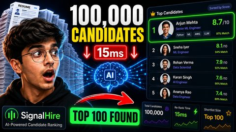

# 🎯 SignalHire — AI-Powered Candidate Ranking

> **100,000 profiles → top 100 best matches** for a Senior AI Engineer role.  
> Built for the Redrob AI Challenge (India Runs Hackathon).

[]()
[]()
[]()
[]()
[]()

📚 **[Full Documentation](https://devanshsrajput.github.io/SignalHire/)**

### 🎬 Walkthrough Video

[](https://youtu.be/zaNRSn0xyzU)

Click the thumbnail above to watch the walkthrough on YouTube.

---

## ✨ Features at a Glance

| | |
|---|---|
| 🚀 **GPU-accelerated precompute** | Embed 100K profiles in ~4 min via `all-MiniLM-L6-v2` |
| ⚡ **Live re-ranking** | Drag sliders → instant 100K re-score (single matrix multiply) |
| 🧠 **Evidence-cited reasoning** | Every score cites the exact skill or sentence that triggered it |
| 🛡️ **Adversarial detection** | Honeypot / ghost / pure-research profiles caught & disqualified |
| 📊 **Fairness audit** | Shortlist vs pool distribution by education tier, country, YoE |
| 🎛️ **Diversity control** | MMR slider — penalize near-duplicates, surface distinct archetypes |
| 🕶️ **Blind screening** | Hide names/companies/institutions to reduce reviewer bias |
| 📦 **One-command export** | Submission CSV + personalized outreach pack + ranking config |

---

## 📋 Table of Contents

- [Pipeline](#pipeline)
- [Quick Start](#quick-start)
- [How to Run](#how-to-run)
  - [Precompute (GPU)](#1-precompute-gpu)
  - [Rank (CPU)](#2-rank-cpu)
  - [Dashboard](#3-dashboard)
  - [Docker](#docker)
- [Dashboard Deep Dive](#dashboard-deep-dive)
- [How Scoring Works](#how-scoring-works)
- [Disqualification & Penalties](#disqualification--penalties)
- [Project Structure](#project-structure)
- [Output Format](#output-format)
- [Sandbox Constraints](#sandbox-constraints)
- [Performance](#performance)
- [Contributing](#contributing)

---

## Pipeline

```
                    candidates.jsonl (100K)
                            │
                            ▼
          ┌──────────────────────────────────────┐
          │  PHASE A: Precompute (GPU, ~4 min)   │
          │                                      │
          │  Stream JSONL ─► Disqualify fakes    │
          │         └──► Embed (MiniLM, 384-dim) │
          │         └──► Compute 4 sub-scores    │
          │         └──► Serialize artifacts     │
          └──────────────┬───────────────────────┘
                         │  embeddings.npy + subscores.pkl (~155 MB)
                         ▼
          ┌──────────────────────────────────────┐
          │  PHASE B: Ranking (CPU, <10 s)       │
          │                                      │
          │  Load artifacts ─► Cosine similarity │
          │         └──► Weighted composite      │
          │         └──► argpartition → top 100  │
          │         └──► Evidence-based reasoning│
          │         └──► Validate & write CSV    │
          └──────────────┬───────────────────────┘
                         │
                         ▼
                    submission.csv
                    (100 ranked candidates)
```

---

## Quick Start

```bash
# Setup
python -m venv venv && source venv/bin/activate
pip install -r requirements.txt

# Precompute (GPU recommended)
python precompute.py

# Rank & generate submission
python rank.py

# Launch interactive dashboard
streamlit run app.py
```

### Prerequisites

| Requirement | Notes |
|---|---|
| Python ≥ 3.10 | |
| NVIDIA GPU + CUDA | Optional — speeds precompute ~10×. Set `EMBEDDING_DEVICE = "cpu"` in `config.py` without one. |
| Disk | ~500 MB for data + ~160 MB for generated artifacts |
| RAM | 16 GB recommended |

---

## How to Run

### 1. Precompute (GPU)

Processes all 100K candidates: disqualifies bad actors, generates 384-dim
embeddings via `all-MiniLM-L6-v2`, computes 4 sub-scores per candidate.

```bash
python precompute.py
```

**Artifacts produced** (saved to `artifacts/`):

| File | Size | Description |
|---|---|---|
| `embeddings.npy` | ~147 MB | 384-dim normalized embeddings (99,965 × 384) |
| `candidate_ids.npy` | ~1.5 MB | Parallel array of candidate IDs |
| `jd_embedding.npy` | ~1.7 KB | JD text embedding for cosine similarity |
| `subscores.pkl` | ~7.1 MB | Dict: candidate → 4 sub-scores + penalty multiplier |
| `disqualified.json` | ~4 KB | Log of every disqualified candidate and why |

### 2. Rank (CPU)

Loads artifacts, computes composite scores, picks top 100, generates
evidence-based reasoning, validates output against challenge spec.

```bash
python rank.py
```

**Output:** `output/submission.csv`

Uses a **byte-offset index** (~2 s build) so loading the top 100 candidates
for reasoning is ~100 seeks instead of a full 487 MB file scan.

### 3. Dashboard

```bash
streamlit run app.py
```

An interactive ranking workbench. Every control re-ranks all 100K candidates
in ~50 ms because scoring is a single `float32` matrix multiply over
precomputed artifacts.

### Docker

```bash
docker build -t signalhire .
docker run --rm -v $(pwd)/data:/app/data -v $(pwd)/output:/app/output signalhire python rank.py
```

> The image pre-downloads the embedding model. Add `--gpus all` for GPU.

---

## Dashboard Deep Dive

### 🏆 Shortlist Tab

Each candidate card shows:
- **Stability badge** — how often the candidate stays top-100 under ±20%
  random weight perturbations (200 trials). If 98% → robust ranking, not an
  artifact of one weight choice.
- **Penalty badge** — flagged if consulting/no-code/CV-only penalties applied
- **Horizontal score bars** — technical fit, career quality, availability,
  seniority fit, semantic match
- **Evidence chips** — every JD requirement that matched, with the exact
  skill or text snippet that triggered it. Missing must-haves are flagged in
  red.
- **One-liner reasoning** — cites actual skills and production signals, not
  templated claims

### ⚖️ Compare Tab

Radar-chart side-by-side of up to 4 candidates across all 5 score dimensions.
Shows matched/missing criteria for each.

### 📊 Insights Tab

- **Score landscape** — histogram of top 5000 scores with top-100 cutoff
- **Fairness audit** — shortlist vs full-pool distribution by education tier,
  country, and years of experience. Helps detect encoded bias.

### 🛡️ Integrity Tab

Displays all disqualified candidates by category (honeypot, ghost, pure
research) with concrete examples showing *why* each was caught.

### 📤 Export Tab

| Export | Format | Description |
|---|---|---|
| Submission CSV | CSV | Challenge-format: id, rank, score, evidence reasoning |
| Outreach pack | Markdown | Top-10 personalized first-touch drafts |
| Ranking config | JSON | Weights, JD label, shortlist IDs — reproducible snapshot |

### 🎛️ Sidebar Controls

| Control | Effect |
|---|---|
| **Custom JD** | Paste any job description or query → embedded on the fly and ranked against |
| **Weight sliders** | Drag any signal weight → 100K re-score in ~50 ms |
| **Diversity (MMR)** | 0 = pure score. Higher values penalize similarity to already-selected profiles |
| **Blind screening** | Hides names, companies, institutions |

---

## How Scoring Works

### Composite Formula

```
S = penalty_multiplier × (
    0.35 × technical_fit
  + 0.25 × career_quality
  + 0.20 × availability_signal
  + 0.12 × seniority_fit
  + 0.08 × semantic_similarity
)
```

All sub-scores normalized to [0, 1].

### Signal Details

| Signal | Weight | Components |
|---|---|---|
| **Technical Fit** | 0.35 | JD must-haves: embeddings/retrieval (0.25), vector DBs (0.20), Python (0.15), eval framework (0.15). Nice-to-haves: LLM fine-tuning (0.10), learning-to-rank (0.10), HR-tech (0.05). Production/retrieval keyword bonuses. |
| **Career Quality** | 0.25 | Non-consulting role (+0.30). ML/AI title at ≥50 person company (+0.15). Median tenure ≥36mo (+0.25), ≥24mo (+0.20), ≥18mo (+0.05). Upward title progression (+0.20). |
| **Availability** | 0.20 | Open to work (+0.25). Active ≤30d (+0.20), ≤90d (+0.12), ≤180d (+0.06). Response rate (×0.15). Interview rate (×0.15). Notice ≤30d (+0.05), ≤60d (+0.035). |
| **Seniority Fit** | 0.12 | YoE 6–9 → 1.0, 4–5/10–12 → 0.7, 3/13–15 → 0.4, else → 0.1. Tier-1 education (+0.05), Tier-2 (+0.02). |
| **Semantic Similarity** | 0.08 | Cosine similarity between profile embedding and JD embedding — catches strong engineers whose plain language misses keyword checks. |

### Word-Boundary Keyword Matching

All keyword scans use `textmatch.py` — stems of 4+ characters may extend
(e.g. `"eval"` matches `"evaluation"`) while short keywords (`"rag"`, `"mrr"`,
`"map"`, `"e5"`) must match as whole words. This eliminates false positives
like `"rag"` inside `"storage"`.

### Evidence-Based Reasoning

`evidence.py` traces every JD requirement hit back to either a declared skill
(with proficiency weight) or a concrete sentence in the career history. The
reasoning string in the CSV only claims what actually exists, and calls out
missing must-haves as gaps.

---

## Disqualification & Penalties

### Hard Disqualify (Removed from Pool)

| Rule | Trigger | Why |
|---|---|---|
| 🍯 **Honeypot** | YoE > career timeline + 5 yr buffer | Dataset seeds impossible-YoE profiles |
| 👻 **Ghost** | Completeness < 5% + no verified email/phone | Near-empty profiles |
| 🔬 **Pure Research** | All roles "researcher" + zero deployment evidence | No industry relevance |

### Soft Penalties (Score Multipliers)

| Condition | × | Effect |
|---|---|---|
| All roles at consulting firms (TCS, Infosys, Wipro, etc.) | **0.15** | Severely penalizes pure-consulting careers |
| No coding activity > 18 months | **0.80** | Flags stale skills |
| CV/speech/robotics only, no retrieval signals | **0.85** | Niche focus, poor JD alignment |

---

## Project Structure

```
SignalHire/
├── 📄 config.py              # Weights, paths, keyword lists, penalties
├── 📄 disqualify.py          # Honeypot/ghost/research detection + soft penalties
├── 📄 signals.py             # 4 sub-score functions (technical, career, availability, seniority)
├── 📄 evidence.py            # JD requirement → skill/sentence trace + honest reasoning
├── 📄 engine.py              # Vectorized re-ranking, MMR diversity, stability analysis
├── 📄 textmatch.py           # Word-boundary keyword matching (no false positives)
├── 📄 precompute.py          # Phase A: ingest → embed → score → serialize
├── 📄 rank.py                # Phase B: load → score → top-100 → reasoning → CSV
├── 📄 app.py                 # Interactive Streamlit dashboard (6 tabs)
│
├── 📁 data/
│   ├── candidates.jsonl      # 100K candidate profiles (~487 MB)
│   ├── job_description.docx  # Target job description
│   ├── validate_submission.py  # Challenge validator
│   ├── candidate_schema.json   # Data schema
│   └── sample_*              # Samples
│
├── 📁 artifacts/             # Generated by precompute.py
│   ├── embeddings.npy        # (99965, 384) float32
│   ├── candidate_ids.npy     # 99965 object array
│   ├── jd_embedding.npy      # (384,) float32
│   ├── subscores.pkl         # 99965 entries
│   ├── disqualified.json     # ~35 entries
│   └── demographics.csv      # Cached pool demographics
│
├── 📁 output/
│   └── submission.csv        # Final validated output
│
├── 📄 Documentation.md       # Complete project documentation
├── 📁 Initial-Documentation/ # Original planning docs (PRD, TRD, etc.)
├── requirements.txt
├── Dockerfile
└── GOOD_FIRST_ISSUES.md      # Starter tasks for contributors
```

---

## Output Format

`output/submission.csv` — validated per challenge spec:

```csv
candidate_id,rank,score,reasoning
CAND_0081846,1,0.870,"6.7yr Lead AI Engineer at Razorpay; strong match on embeddings, vector search, python, information retrieval; production evidence (serving, ndcg); actively looking, 73% response rate, 30d notice."
CAND_0055905,2,0.869,"8.1yr Senior Machine Learning Engineer at Flipkart; strong match on embeddings, vector search, python, information retrieval; production evidence (deployed, serving); actively looking, 87% response rate."
```

**Validation rules:**
| Rule | Enforced |
|---|---|
| Exactly 100 rows (ranks 1–100) | ✅ |
| Scores non-increasing by rank | ✅ |
| Tie-breaking by candidate_id ascending | ✅ |
| candidate_id format `CAND_XXXXXXX` | ✅ |
| Reasoning ≤ 300 chars, no newlines | ✅ |

---

## Sandbox Constraints

| Constraint | How It's Met |
|---|---|
| **CPU-only ranking** | Phase B uses NumPy — no GPU dependency |
| **16 GB RAM** | Streaming JSONL, batched embedding, vectorized ops |
| **No network** | Model pre-downloaded at build time |
| **<5 min ranking** | `np.argpartition` O(N) + byte-offset seek index |

---

## Performance

Measured on **NVIDIA RTX 3050 (6 GB) + 12-core CPU**:

| Phase | Device | Time | Throughput |
|---|---|---|---|
| Precompute (100K → 99,965) | GPU (CUDA) | **~4.2 min** | ~400 cand/s |
| Offset index build | CPU | **~1.5 s** | ~67K lines/s |
| Ranking + validation | CPU | **~3.1 s** | ~32K cand/s |
| **Dashboard re-rank** | CPU | **~50 ms** | 2M cand/s |

---

## Contributing

Check out [GOOD_FIRST_ISSUES.md](GOOD_FIRST_ISSUES.md) — there are 10
well-scoped tasks from trivial (`id_batch` cleanup) to medium (pytest
regression suite, spec-compliance fixes). Each one has:

- A clear definition of done
- File paths and line references
- Estimated difficulty

---

*Built for the Redrob AI Challenge — India Runs Hackathon*
